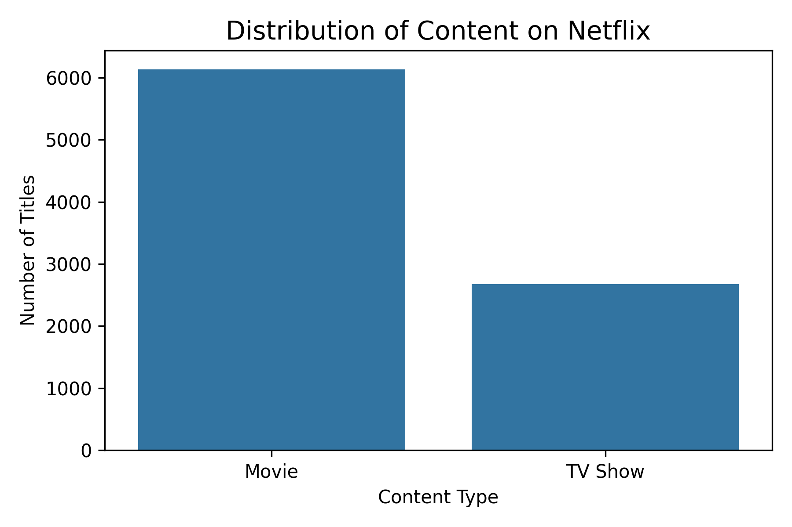
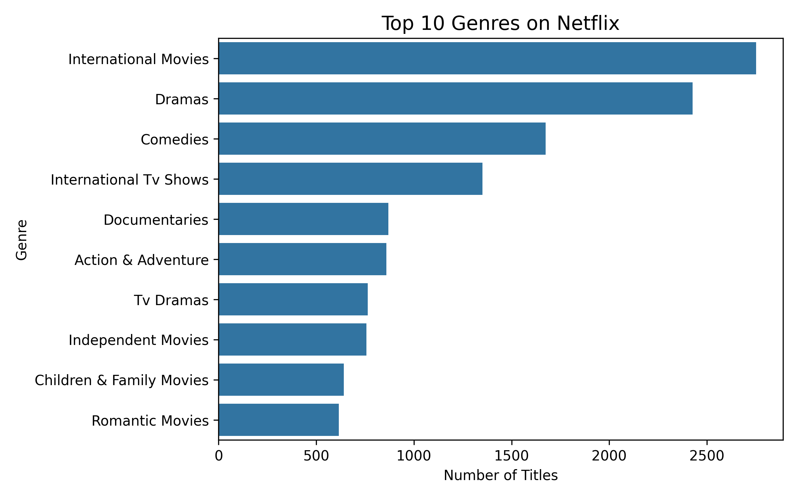
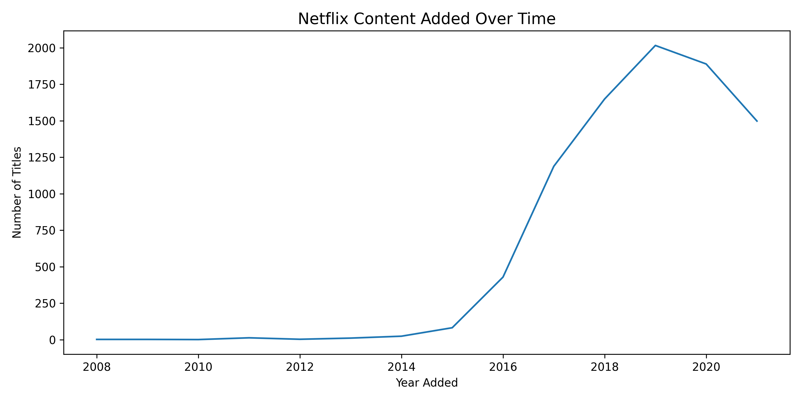

# 🎬 Netflix EDA Dashboard


## 📌 Project Overview

This project performs an **end-to-end Exploratory Data Analysis (EDA)** on the Netflix Titles dataset.
It demonstrates how raw data can be transformed into **clear insights and visuals** using Python, following **industry-standard project structure**.

The goal is to analyze **content trends, genres, countries, ratings, and time-based growth** of Netflix content in a clean, reproducible way.

---

## 🧠 Key Questions Answered

* What is the distribution of Movies vs TV Shows?
* Which genres dominate Netflix content?
* Which countries produce the most content?
* How has Netflix content grown over time?
* What are the most common maturity ratings?
* How are movie durations distributed?

---

## 🛠 Tech Stack

* **Python**
* **Pandas & NumPy** – Data manipulation
* **Matplotlib & Seaborn** – Visualization
* **Jupyter Notebook** – Exploration
* **Git & GitHub** – Version control

---

## 📂 Project Structure

```
netflix-eda-dashboard/
│
├── data/           # Raw & cleaned datasets
├── notebooks/      # Step-by-step analysis notebooks
├── src/            # Modular Python scripts
├── assets/         # Generated visualizations
├── main.py         # Project entry point
├── requirements.txt
├── README.md
└── .gitignore
```

---

## ▶️ How to Run This Project

1. **Clone the repository**

```bash
git clone https://github.com/Dimple-Choudhary/Netflix-eda-dashboard.git
cd Netflix-eda-dashboard
```

2. **Create virtual environment & activate**

```bash
python -m venv venv
venv\Scripts\activate   # Windows
```

3. **Install dependencies**

```bash
pip install -r requirements.txt
```

4. **Run the project**

```bash
python main.py
```

📌 Generated plots will be saved inside the **assets/** folder.

---

## 📊 Sample Visualizations

> 




## 📈 Key Insights

* Movies form the majority of Netflix content.
* Drama and International Movies dominate the platform.
* The United States contributes the highest number of titles.
* Significant content growth observed after 2015.
* TV-MA is the most common maturity rating.

---

## 🚀 Future Improvements

* Build an interactive **Streamlit dashboard**
* Perform NLP on descriptions
* Add recommendation-style analysis
* Add automated tests
* Deploy visuals online

---

## 👩‍💻 Author

**Dimple Choudhary**
Aspiring Data Scientist / Data Analyst

---

⭐ If you found this project useful, consider starring the repository!
